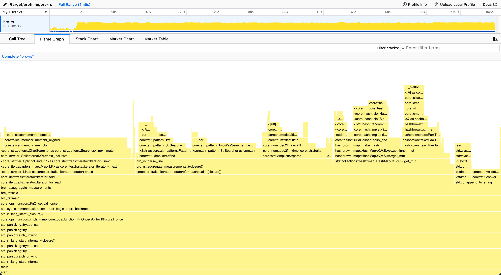
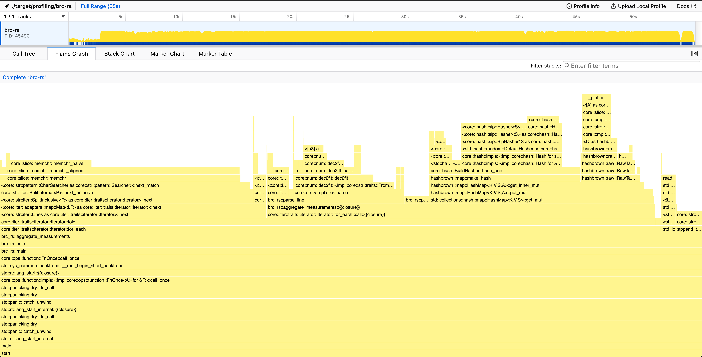

# One Billion Row Challenge in Rust

This repository contains my implementation in Rust for the One Billion Row Challenge (1BRC), which tests the limits of processing one billion rows from a text file. [Original challenge repository](https://github.com/gunnarmorling/1brc)

The main idea is to explore optiziming performance of a program through profiling and parallellism, with also trying to use only ["Safe Rust"](https://doc.rust-lang.org/nomicon/meet-safe-and-unsafe.html#meet-safe-and-unsafe). All error handling of this project is handled poorly knowingly, and only the happy path is considered.

## Challenge

The text file contains temperature values for a range of weather stations.
Each row is one measurement in the format `<string: station name>;<double: measurement>`, with the measurement value having exactly one fractional digit.
The following shows ten rows as an example:

```
Hamburg;12.0
Bulawayo;8.9
Palembang;38.8
St. John's;15.2
Cracow;12.6
Bridgetown;26.9
Istanbul;6.2
Roseau;34.4
Conakry;31.2
Istanbul;23.0
```

The task is to write a program which reads the file, calculates the min, mean, and max temperature value per weather station, and emits the results on stdout like this
(i.e. sorted alphabetically by station name, and the result values per station in the format `<min>/<mean>/<max>`, rounded to one fractional digit):

```
{Abha=-23.0/18.0/59.2, Abidjan=-16.2/26.0/67.3, Abéché=-10.0/29.4/69.0, Accra=-10.1/26.4/66.4, Addis Ababa=-23.7/16.0/67.0, Adelaide=-27.8/17.3/58.5, ...}
```

## Getting Started

### Prerequisites

Install [Rust](https://rustup.rs/), [samply](https://github.com/mstange/samply) for profiling, [hyperfine](https://github.com/sharkdp/hyperfine) for benchmarks

### Building the Project

Compile the project in release mode for optimal performance:

```sh
cargo build --release
```

### Running Tests

To run tests, especially designed to handle smaller datasets for quick feedback:

```sh
cargo test
```

This tests the example files inside `samples`-directory

### Generating measurements

To use the profiling and benchmarking, it's useful to generate a bigger file for measurable differences.
Usage for creating a `measurements.txt` with 1 billion measurements

```sh
./create_measurements.sh 1000000000
```

Usage for creating a `measurements-1m.txt` with 1 million measurements

```sh
./create_measurements.sh 1000000 measurements-1m.txt
```

**NOTE**: The file with 1 billion measurements is over 10 GB in size.

### Profiling

```sh
./profile.sh <filename>
```

This script runs the program with profiling enabled using samply, and opens the profile in Firefox Profiler in browser after the program exits. Default file name is `measurements.txt`

### Benchmarking

```sh
./bench.sh <filename>
```

This script uses hyperfine to measure an average run time of 10 runs, with no warmup. Default file name is `measurements.txt`

**NOTE**: For profiling and benchmarking, it is recommended to generate a bigger input file to see measurable differences. see [Generating measurements](#generating-measurements)

## Optimization Results

Here is a table for a quick summary of the current progress of the optimizations.
Benchmarks and profiling results shown below are run against a `measurements.txt` generated with `./create_measurements.sh 1000000000`, having 1 billion entries using a 10-core 14" Macbook M1 Max 32 GB.

| Optimization                                                                                  | Time (mean ± σ):  | Improvement over previous version                      | Summary                                                                                                                  |
| --------------------------------------------------------------------------------------------- | ----------------- | ------------------------------------------------------ | ------------------------------------------------------------------------------------------------------------------------ |
| [Initial Version](#initial-version)                                                           | 149.403 ± 0.452   | N/A                                                    | Naive single-core implementation with BufReader & HashMap                                                                |
| [Unnecessary string allocation](#unnecessary-string-allocation)                               | 102.907 s ± 1.175 | <strong style="color:lime;"> -46,496 s (-31%)</strong> | Remove an unnecessary allocation of a string inside loop                                                                 |
| [Iterate over string slices instead of String](#iterate-over-string-slices-instead-of-string) | 63.493 s ± 1.368  | <strong style="color:lime;"> -39,414 s (-38%)</strong> | Read the entire file into memory first, iterate over string slices, move away from using Entry API for accessing hashmap |
| [Improving the line parsing #1](#improving-line-parsing)                                      | 55.686 s ± 1.304  | <strong style="color:lime;"> -7,807 s (-12%)</strong>  | Replace `str::find` with a custom, problem-specific separator finder                                                     |

### Initial Version

Nothing special really, just a quick version to get things going with a `HashMap<String,WeatherStationStats`.

Struggled too long with getting a correct implementation of the rounding calculation to pass the original test suite.

Going forward, the rounding conventions will change, with the test files being generated with the initial version of this project with only the conversion logic changed.

```sh
~/src/github/brc-rs (master*) » ./bench.sh
Benchmark 1: ./target/release/brc-rs
  Time (mean ± σ):     149.403 s ±  0.452 s    [User: 144.499 s, System: 2.486 s]
  Range (min … max):   149.037 s … 150.110 s    5 runs
```


Looking at the flame graph, we spend ~30% of the time in `<std::io::Lines as core::iter::traits::iterator::Iterator>::next`. That is, reading the file line by line. This most likely due to the use of [`BufRead::lines()`](https://doc.rust-lang.org/std/io/trait.BufRead.html#method.lines) for iterating the lines, as it creates a new `String` for each row, allocating memory. This allocation of each line separately creates unnecessary overhead, and probably should be looked into first.

Inside the `calc`-function we also spend 13% of the time creating strings and 17% of the time dropping Strings, freeing the allocated memory. We spend 16% in actually parsing the line, and 22% doing hashmap operations.

### Unnecessary string allocation

Even though the profile indicates that looking into the reading of the file should probably be looked into first, during writing the previous analysis I realized that I made a totally unnecessary string allocation inside `calc`.

As we receive a String from the iterator already and it isn't used in any other way than passed as a string slice to `parse_line`
, we can instead pass it to `parse_line` and return the original line string but truncated to only contain the station name.
By doing this, we can use that as the key for the hashmap instead of allocating a new string entirely for it.

```sh
~/src/github/brc-rs (main*) » ./bench.sh
Benchmark 1: ./target/release/brc-rs
  Time (mean ± σ):     102.907 s ±  1.175 s    [User: 98.842 s, System: 2.179 s]
  Range (min … max):   101.440 s … 104.566 s    5 runs
```

This just goes to show that allocating another string unnecessarily with this amount of data has already a significant impact on performance.


### Iterate over string slices instead of String

The reading of the file has grown to 44% time spent. This needs to be addressed.

Let's first investigate the iterator performance with writing some test programs:

```rust
// test-bufread-lines.rs
use std::io::BufRead;
fn main() {
    let now = std::time::Instant::now();
    let f = std::fs::File::open("measurements.txt").unwrap();
    let reader = std::io::BufReader::new(f);
    let mut amount_read = 0;
    for line in reader.lines() {
        amount_read += line.unwrap().len() + 1; // add the newline character back
    }
    println!("reading {amount_read} bytes took {:#?}", now.elapsed());
}
```

This program emulates the current implementations line iteration by using the [`BufRead::lines`](https://doc.rust-lang.org/std/io/trait.BufRead.html#method.lines)-function to iterate over each line.
Note that the lines returned are all of type `String` underneath.

```sh
~/src/github/brc-rs (main*) » rustc -O test-bufread-lines.rs
~/src/github/brc-rs (main*) » hyperfine ./test-bufread-lines
Benchmark 1: ./test-bufread-lines
  Time (mean ± σ):     55.872 s ±  0.080 s    [User: 53.816 s, System: 1.860 s]
  Range (min … max):   55.764 s … 56.055 s    10 runs
```

So 55 seconds for iterating the file line by line? That seems kind of slow. Let's try to see if we can improve on that.

Now let's look at the following program:

```rust
// test-read-to-string-lines.rs
use std::io::Read;
fn main() {
    let now = std::time::Instant::now();
    let f = std::fs::File::open("measurements.txt").unwrap();
    let mut reader = std::io::BufReader::new(f);
    let mut s = String::new();
    reader.read_to_string(&mut s).unwrap();
    let mut amount_read = 0;
    for line in s.lines() {
        amount_read += line.len() + 1; // add the newline character back
    }
    println!("reading {amount_read} bytes took {:#?}", now.elapsed());
}
```

Instead of using `BufRead::lines`, here we first read the entire file into a `String` and then iterate over the lines with `str::lines`.

```sh
~/src/github/brc-rs (main*) » rustc -O test-read-to-string-lines.rs
~/src/github/brc-rs (main*) » hyperfine ./test-read-to-string-lines
Benchmark 1: ./test-read-to-string-lines
  Time (mean ± σ):     19.514 s ±  0.793 s    [User: 15.472 s, System: 1.311 s]
  Range (min … max):   18.939 s … 21.331 s    10 runs
```

Reading the entire string first into memory results in a staggering 66% performance improvement.
The penalty coming from the `BufRead::lines`-iterator is that it allocates every line separately as a `String`.
This means on each line iteration, we allocate (and also de-allocate) memory, which causes significant overhead.
However, reading the entire file into a single String comes with a glaring drawback: the entire file will be stored in memory at once, so the memory footprint will be affected.

```sh
~/src/github/brc-rs (main*) » /usr/bin/time -l ./test-bufread-lines
reading 13795898567 bytes took 56.876117291s
         --- redacted ---
         1114688  peak memory footprint
```

Peak memory footprint of ~1.1 MB when using the buffered reader.

```sh
~/src/github/brc-rs (main*) » /usr/bin/time -l ./test-read-to-string-lines
reading 13795898567 bytes took 21.289027s
          --- redacted ---
         13803464960  peak memory footprint
```

The peak memory footprint is now on the neighbourhood of 13.8GB, so a roughly 10,000x increase over using the buffered reader.
This isn't ideal and not the final solution I'd hope to achieve, but for now it's good enough (and allowed in the original rules, so 🤷).
Further improvements will be done later on, but for that we need to look at other parts to refactor until we can get back to this.

Now that we iterate over string slices instead of strings, we need to revert our `parse_line` to its previous state.
Another problem arises with the [`HashMap::entry()`](https://doc.rust-lang.org/std/collections/hash_map/struct.HashMap.html#method.entry) access method into the hashmap.
The function requires passing the key by value instead of reference, meaning we would need to allocate a new string for the station name on each iteration.
This would result as going back to allocating on each iteration, removing the optimization.
[The Entry API in the standard library doesn't seem to work with expensive keys](https://stackoverflow.com/questions/51542024/how-do-i-use-the-entry-api-with-an-expensive-key-that-is-only-constructed-if-the/56921965#56921965)

Let's instead use [`HashMap::get_mut()`](https://doc.rust-lang.org/std/collections/hash_map/struct.HashMap.html#method.get_mut) with a `match`, either modifying the value or inserting a new one.
Here we limit the allocations to only occur on the inserts, and `get_mut()` happily takes a string slice as argument.

```sh
~/src/github/brc-rs (main*) » ./bench.sh
Benchmark 1: ./target/release/brc-rs
  Time (mean ± σ):     63.493 s ±  1.368 s    [User: 58.224 s, System: 2.112 s]
  Range (min … max):   62.183 s … 65.675 s    5 runs
```



The line reading still uses quite a significant portion of the time (27% line iteration + 9% for loading the string into memory). However, it is not the biggest consumer of time anymore, which indicates we need to change our focus.
We spend 39% of time inside `parse_line()` and need to do some improvements on that next.
The `HashMap::get_mut()` is also starting to creep up in the chart with 23% of time spent.

### Improving line parsing

Now that we have gotten rid of most of the "free" improvements out of the way, we can start looking at actually improving the performance of the parsing logic of the lines.
This section is divided in two parts; finding the data separator followed by improving the parsing logic.

#### Replacing `str::find` with a custom separator finder

Biggest share of time inside `parse_line()` is spent in [`str::find`](https://doc.rust-lang.org/std/primitive.str.html#method.find).
This is used for separating the station name from the measurement data point.
Using a generic "find from string"-function is fine for initial implementation and good for readability, but performance is being left on the table if we don't utilise all the knowledge we have.

Reading the [challenge rules](https://github.com/gunnarmorling/1brc?tab=readme-ov-file#rules-and-limits), we know that the station name is a valid UTF-8 string with length varying between 1 and 100 bytes. The maximum length of the measurement data point is at most 5 characters ("-99.9") and is always pure ASCII.

As the average length of a measurement is much smaller than the UTF-8 string, we can change our approach to start reading the line from the end.
Also as the measurement is known to be pure ASCII, we can iterate over the bytes directly instead of the characters.

This makes finding the separator use at most six byte comparison operations. We could further reduce this down to three, as there is always guaranteed to be 1 fractional digit, a period, and a whole number, but this is improvement is quite insignificant and we'd need to remove it anyway for the next part.

```sh
~/src/github/brc-rs (main*) » ./bench.sh
Benchmark 1: ./target/release/brc-rs
Time (mean ± σ): 55.686 s ± 1.304 s [User: 50.524 s, System: 2.026 s]
Range (min … max): 54.354 s … 57.095 s 5 runs
```



From the graph we see that `parse_line()` has shrunk significantly, with now the floating point value parsing taking majority of the time.

