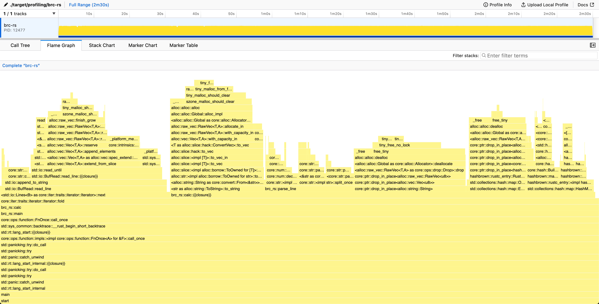
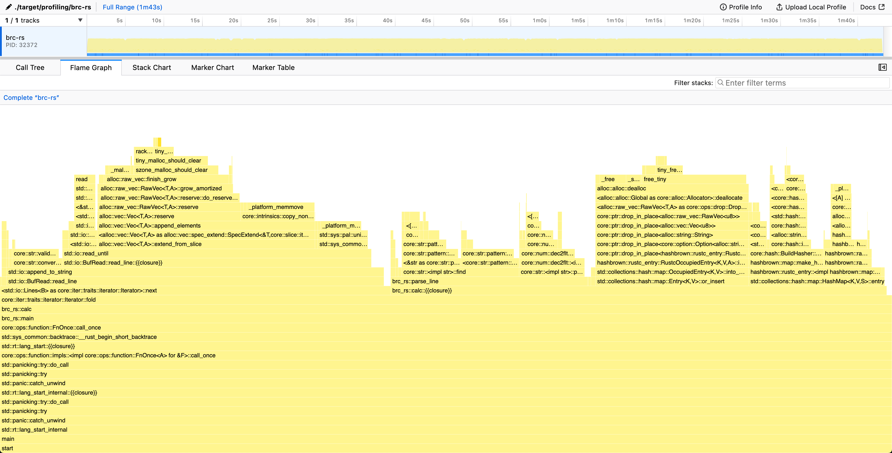

# One Billion Row Challenge in Rust

This repository contains my implementation in Rust for the One Billion Row Challenge (1BRC), which tests the limits of processing one billion rows from a text file. [Original challenge repository](https://github.com/gunnarmorling/1brc)

The main idea is to explore optiziming performance of a program through profiling and parallellism, with also trying to use only ["Safe Rust"](https://doc.rust-lang.org/nomicon/meet-safe-and-unsafe.html#meet-safe-and-unsafe). All error handling of this project is handled poorly knowingly, and only the happy path is considered.

## Challenge

The text file contains temperature values for a range of weather stations.
Each row is one measurement in the format `<string: station name>;<double: measurement>`, with the measurement value having exactly one fractional digit.
The following shows ten rows as an example:

```
Hamburg;12.0
Bulawayo;8.9
Palembang;38.8
St. John's;15.2
Cracow;12.6
Bridgetown;26.9
Istanbul;6.2
Roseau;34.4
Conakry;31.2
Istanbul;23.0
```

The task is to write a program which reads the file, calculates the min, mean, and max temperature value per weather station, and emits the results on stdout like this
(i.e. sorted alphabetically by station name, and the result values per station in the format `<min>/<mean>/<max>`, rounded to one fractional digit):

```
{Abha=-23.0/18.0/59.2, Abidjan=-16.2/26.0/67.3, Abéché=-10.0/29.4/69.0, Accra=-10.1/26.4/66.4, Addis Ababa=-23.7/16.0/67.0, Adelaide=-27.8/17.3/58.5, ...}
```

## Getting Started

### Prerequisites

Install [Rust](https://rustup.rs/), [samply](https://github.com/mstange/samply) for profiling, [hyperfine](https://github.com/sharkdp/hyperfine) for benchmarks

### Building the Project

Compile the project in release mode for optimal performance:

```sh
cargo build --release
```

### Running Tests

To run tests, especially designed to handle smaller datasets for quick feedback:

```sh
cargo test
```

This tests the example files inside `samples`-directory

### Generating measurements

To use the profiling and benchmarking, it's useful to generate a bigger file for measurable differences.
Usage for creating a `measurements.txt` with 1 billion measurements

```sh
./create_measurements.sh 1000000000
```

Usage for creating a `measurements-1m.txt` with 1 million measurements

```sh
./create_measurements.sh 1000000 measurements-1m.txt
```

**NOTE**: The file with 1 billion measurements is over 10 GB in size.

### Profiling

```sh
./profile.sh <file-name-without-extension>
```

This script runs the program with profiling enabled using samply, and opens the profile in Firefox Profiler in browser after the program exits. Default file name is `measurements`

### Benchmarking

```sh
./bench.sh <file-name-without-extension>
```

This script uses hyperfine to measure an average run time of 10 runs, with no warmup. Default file name is `measurements`

**NOTE**: For profiling and benchmarking, it is recommended to generate a bigger input file to see measurable differences. see [Generating measurements](#generating-measurements)

## Optimization Results

Here is a table for a quick summary of the current progress of the optimizations.
Benchmarks and profiling results shown below are run against a `measurements.txt` generated with `./create_measurements.sh 1000000000`, having 1 billion entries using a 10-core 14" Macbook M1 Max 32 GB.

| Optimization                                                    | Time (mean ± σ):  | Improvement over previous version                      | Summary                                                   |
| --------------------------------------------------------------- | ----------------- | ------------------------------------------------------ | --------------------------------------------------------- |
| [Initial Version](#initial-version)                             | 149.403 ± 0.452   | N/A                                                    | Naive single-core implementation with BufReader & HashMap |
| [Unnecessary string allocation](#unnecessary-string-allocation) | 102.907 s ± 1.175 | <strong style="color:lime;"> -46,496 s (-31%)</strong> | Remove an unnecessary allocation of a string inside loop  |
|                                                                 |                   |                                                        |                                                           |

### Initial Version

Nothing special really, just a quick version to get things going with a `HashMap<String,WeatherStationStats`.

Struggled too long with getting a correct implementation of the rounding calculation to pass the original test suite.

Going forward, the rounding conventions will change, with the test files being generated with the initial version of this project with only the conversion logic changed.

```sh
~/src/github/brc-rs (master*) » ./bench.sh
Benchmark 1: ./target/release/brc-rs
  Time (mean ± σ):     149.403 s ±  0.452 s    [User: 144.499 s, System: 2.486 s]
  Range (min … max):   149.037 s … 150.110 s    5 runs
```



Looking at the flame graph, we spend ~30% of the time in `<std::io::Lines as core::iter::traits::iterator::Iterator>::next`. That is, reading the file line by line. This most likely due to the use of [`BufRead::lines()`](https://doc.rust-lang.org/std/io/trait.BufRead.html#method.lines) for iterating the lines, as it creates a new `String` for each row, allocating memory. This allocation of each line separately creates unnecessary overhead, and probably should be looked into first.

Inside the `calc`-function we also spend 13% of the time creating strings and 17% of the time dropping Strings, freeing the allocated memory. We spend 16% in actually parsing the line, and 22% doing hashmap operations.

### Unnecessary string allocation

Even though the profile indicates that looking into the reading of the file should probably be looked into first, during writing the previous analysis I realized that I made a totally unnecessary string allocation inside `calc`.

As we receive a String from the iterator already and it isn't used in any other way than passed as a string slice to `parse_line`
, we can instead pass it to `parse_line` and return the original line string but truncated to only contain the station name.
By doing this, we can use that as the key for the hashmap instead of allocating a new string entirely for it.

```sh
~/src/github/brc-rs (main*) » ./bench.sh
Benchmark 1: ./target/release/brc-rs
  Time (mean ± σ):     102.907 s ±  1.175 s    [User: 98.842 s, System: 2.179 s]
  Range (min … max):   101.440 s … 104.566 s    5 runs
```

This just goes to show that allocating another string unnecessarily with this amount of data has already a significant impact on performance.


